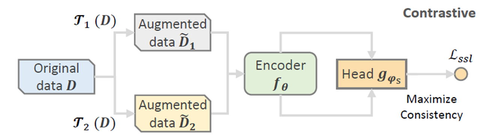
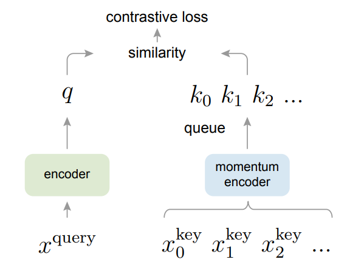

# 数据增强和对比学习

## 1. 数据增强

**数据增强**(Data Augmentation)，是一种通过对训练数据进行**变换**(transform)来生成新样本的技术。其目标是通过增加数据的多样性，提供更多信息给模型，从而提高模型的泛化能力。

根据操作对象的不同，大致分为三类：

- 序列数据，如文字序列
  - 添加噪声
  - 数据截取
  - 随机交换、删除等
- 图像数据
  - 平移、旋转、缩放、裁剪等
  - 添加噪声、mask等
  - 颜色扰动
- 图结构
  - 节点或边特征向量的随机mask
  - 节点或边的随机删除、添加等
  - 随机采样子图

## 2. 对比学习

> **有监督学习**(Supervised Learning)，是一种从有标注数据中学习预测模型的机器学习方法，常用于回归、分类等任务。例如，给你一堆手写数字（范围0-9）的图片数据集，每张图片都有对应的真实数字标签，通过每条样本数据以及对应标签，你预测未知样本的数字结果。
>
> **无监督学习**(Unsupervised Learning)，是一种从无标注数据中学习预测模型的机器学习方法，用于学习数据中的统计规律和潜在结构，如聚类算法。例如，给你一堆手写数字（范围0-9）的图片数据集，但是没有任何标注信息，让你挖掘给你的数据中有什么统计规律。
>
> **自监督学习**(Self-supervised Learning)，是一种从无标注数据中挖掘出自身监督信息来进行监督学习和训练的机器学习方法。自监督学习虽然需要标注数据，但不用人工提供，而是来源数据本身。主要用于在未标注数据上做预训练，然后迁移到有标注数据的下游任务上。

**对比学习**(Contrastive Learning)，是一种特殊的无监督学习方法（自监督学习），通过让模型将同一样本的不同表示（正样本对）跟接近，不同样本的表示更**分散**（不只是远离，致力于不同样本趋向于均匀分布），使其学到更有用的特征表示，从而更好的应用在有标签的下游任务中。

### 2.1 对比学习方法

如下图所示，原始数据$D$通过多种数据增强方法$\Gamma(·)$，得到数据增强的结果$\tilde{D}$，将$\tilde{D}$送到一个Encoder中学习特征。这个Encoder可以是任意一个深度学习模型，如GNN、GCN。我们将学习到的特征用$f_\theta(\tilde D)$，再将这个特征通过一个投影头(Head projection)$g_{\phi_s}(·)$用来做对比学习任务，一般为一层MLP层，最后将多个数据增强的特征计算对比损失loss，使其让同一样本增强后的$\tilde D$相近，不同样本之间分散。

将上述流程公式化表达为：
$$
f_{\theta}^{\ast}=arg\min_{f_{\theta},g_{\phi_s}} \mathcal{L}_{ssl}(g_{\phi_s}(f_{\theta}(\tilde D_1),f_{\theta}(\tilde D_2)))
$$

### 2.2 数据增强

见上文。针对不同的领域，使用不同的数据增强方法，来生成多个样本对。

### 2.3 目标函数

**1. InfoNCE loss**

对比学习中常用的损失函数为InfoNCE loss。在恺明大佬的MoCo论文中是这样解释的，假设有一个编码好的query特征向量 $q$，以及一系列编码好的样本 $k_0,k_1,k_2,...$，这些可以看作字典里的key。假设字典中只有一个key即 $k_+$跟 $q$ 匹配，互为正样本对，其余key和 $q$互为负样本对。我们现在要设计一个损失函数来指导模型学习，这个损失函数需要满足这些要求，即当query $q$和唯一的正样本 $k_+$相似，并且和其他所有负样本key都不相似的时候，这个loss的值应该比较低。反之，如果 $q$和 $k_+$不相似，或者 $q$和其他负样本的key相似了，那么loss就应该大，从而惩罚模型，促使模型进行参数更新。

InfoNCE loss公式如下。我们可以看出，分子中只计算正样本对的距离，负样本只会在对比损失的分母中出现，当正样本对距离越小，负样本对距离越大，损失越小。
$$
L_q = -log \frac{exp(q·k_+/\tau)}{\textstyle \sum_{i=0}^{k}{exp(q·k_i/\tau)}}
$$
其中 $\tau$为温度系数，是一个超参数，主要作用控制了模型对负样本的区分度。如果设的越大，那么对比损失会对所有的负样本一视同仁，导致模型学习没有轻重。反之，模型会越关注区分困难的负样本，但其实那些负样本很可能是潜在的正样本，这样会导致模型很难收敛或者泛化能力差。

## 3. 相关问题

### 3.1 数据增强和对比学习的关系

数据增强方法是对比学习中的一个至关重要的前置操作，即生成更多的样本对。通过对输入数据进行多种增强，可以创建多个视图(view)，作为对比学习中的样本对。同一个样本生成的不同表示作为正样本对，不同样本生成的表示作为负样本对。

### 3.2 对比学习和有监督学习的区别

有监督学习有真实label和输出y供目标函数计算损失，以此进行模型训练。但是，对比学习没有真实label，而是通过数据增强生成对比学习的正负样本，自动构造输出y和真实label，最后再通过目标函数计算损失训练模型。
