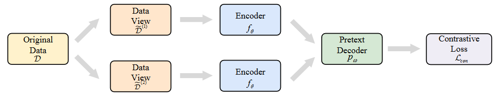

推荐系统中的对比学习研究

> 本文按照上交发表在arxiv上的一篇综述《Contrastive Self-supervised Learning in Recommender Systems: A Survey》进行梳理阐述
>
> 论文地址：https://arxiv.org/abs/2303.09902v2

# 1. 引言

在推荐系统领域，基于深度学习的方法大部分都是集中在有监督学习 (supervised learning)。推荐模型使用丰富的有标签数据（用户-商品交互图 (user-item interactions)）进行训练。但是，用户-商品交互记录相比于整个交互空间来说是非常稀疏的。因此，这些方法通常会遭受数据稀疏性 (data sparsity) 的困扰，同时还容易出现过拟合和泛化能力差的问题。

自监督学习 (self-supervised learning, SSL) 方法，作为一种新的学习范式，提供了一种新的见解去解决上述问题。SSL的基本思想是不通过人工标注的标签而从数据本身提取出可迁移的知识 (transferable knowledge)，这通过设计代理任务 (pretext tasks) 来实现。获得的知识可以被应用在下游任务中。

目前基于SSL的推荐模型可以被分为生成式、对比式和预测式三大类。本文主要介绍基于对比学习 (contrastive learning, CL) 的推荐模型算法。

# 2. 背景

## 2.1 术语定义

- 自监督学习：自监督学习是一种从无标注数据中挖掘出自身监督信息来进行监督学习和训练的机器学习方法。
- 代理任务：代理任务是预先设计并由模型解决的任务。通过学习代理任务的目标函数，模型可以从无标签数据中学习更多通用表征，从而有利于下游任务微调。
- 下游任务：下游任务是指用于评估模型学习出的表征质量效果的任务。比如在推荐领域，下游任务就是推荐任务。一般来说，解决下游任务需要有标签数据。

## 2.2 对比学习

对比学习的核心思想是最大化同一样本不同视图之间的一致性，最小化不同样本不同视图之间的一致性，其中一致性通常由互信息 (mutual information, MI) 衡量。CL的通用流程如图1所示。

图1
