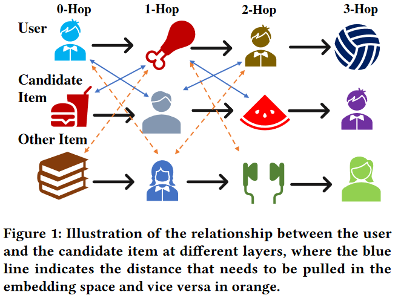
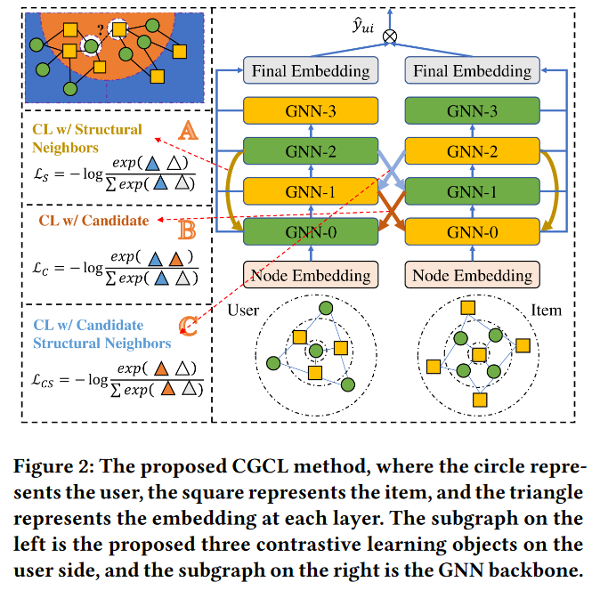
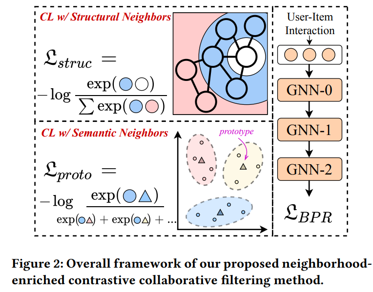
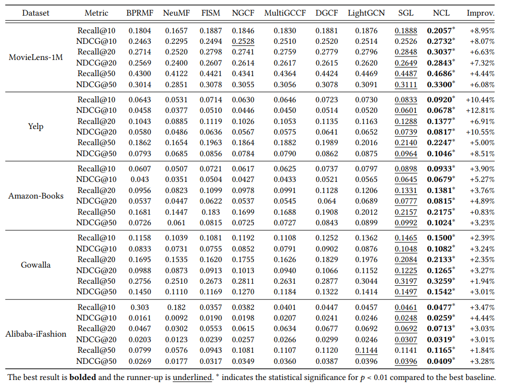

# 1. (CGCL)《Candidate-aware Graph Contrastive Learning for Recommendation》

> title: Candidate-aware Graph Contrastive Learning for Recommendation
>
> published: SIGIR '23
>
> paper: https://github.com/WeiHeCnSH/CGCL-Pytorch-master/blob/main/Candidate-aware%20Graph%20Contrastive%20Learning%20for%20Recommendation.pdf
>
> code: https://github.com/WeiHeCnSH/CGCL-Pytorch-master
>
> keywords：推荐系统、图对比学习
>
> 注：本文方法参考NCL方法

## 背景

- 大部分基于GCL的方法都使用启发式的数据增强方法，如随机节点、边删除，这可能会导致重要信息的丢失。并且使用启发式的策略并不通用，需要根据具体任务人工挑选适合的方法。
- 现有基于GCL的方法忽略用户和候选商品在不同层嵌入表征的关系。
  - 

## 创新点

跨层跨side对比

- 不需要额外数据增强方法，只使用用户和候选商品在不同层的嵌入表征来构建对比视图
- 选取了三种对比视图方法，分别为基于结构邻居对比（自身和二阶邻居对比）、基于候选对比（自身和交互节点的一节邻居对比）和基于候选结构邻居对比（自身的二阶邻居和交互节点的一节邻居对比），从而设计了三个不同的对比损失函数来获取高质量节点表征

## 方法

**假设**：在用户-商品交互图中，每一层的邻居节点信息都是相同的，并且这些同构用户(商品)节点通过卷积传播连接起来。同构节点可以被认为具有相似的语义信息，在嵌入空间中彼此会更接近。

> 以下论文给的公式、代码和论文里的阐述并不一样。笔者按照自己对作者的意图进行公式上的修改。
>
> 笔者只对用户侧的公式进行阐述，商品侧的公式同理可得到。

**part A**

- 建模结构邻居和中心节点的关系

  - 以中心节点自身的嵌入为锚点，中心节点的同构邻居节点嵌入为正例，其他中心节点的同构邻居节点嵌入为负例。

  - $$
    \mathcal{L}_S^U=\sum_{u\in\mathcal{U}}-\log\frac{\exp\left(sim\left(e_u^{(0)},e_u^{(2)}\right)/\tau\right)}{\sum_{v\in\mathcal{U}}\exp\left(sim\left(e_u^{(0)},e_v^{(2)}\right)/\tau\right)}.
    $$

  - 其中 $e_u^{(k)}$ 表示用户第 $ k$ 层GNN得到的嵌入表征。$\mathcal U$ 为全部的用户节点。

**part B**

- 建模用户和候选商品的关系

  - 如果用户$u$与候选商品$i$的交互，则该用户应与嵌入空间中候选商品的历史交互用户相似。此外，用户𝑢不应与嵌入空间中其他商品的历史交互用户相似。

  - 以用户 $u$ 的嵌入为锚点，候选商品 $i$ （与 $u$ 交互的商品）一阶邻居节点嵌入为正例，其他商品的一阶邻居节点嵌入为负例。

  - 
    $$
    \mathcal{L}_C^U=\sum_{u\in\mathcal{U}}-\log\frac{\sum_{i \in \mathcal I^+} \exp\left(sim\left(e_u^{(0)},e_i^{(1)}\right)/\tau\right)}{\sum_{j\in\mathcal{I}}\exp\left(sim\left(e_u^{(0)},e_j^{(1)}\right)/\tau\right)}.
    $$

  - 其中 $e_u^{(k)}$ 表示用户第 $ k$ 层GNN得到的嵌入表征。$\mathcal U$ 为全部的用户节点。$\mathcal I$ 和 $\mathcal I^+$ 分别表示为全部商品节点和与用户 $u$ 交互的商品节点。

**part C**

- 建模用户的结构邻居和候选商品的关系

  - 如果用户$u$与候选商品$i$交互，则该用户二阶邻居节点应与嵌入空间中候选商品的一阶邻居用户相似。此外，用户𝑢不应与嵌入空间中其他商品的历史交互用户相似。

  - 以用户 $u$ 的二阶邻居节点嵌入为锚点，候选商品 $i$ （与 $u$ 交互的商品）一阶邻居节点嵌入为正例，其他商品的一阶邻居节点嵌入为负例。

  - 
    $$
    \mathcal{L}_{CS}^U=\sum_{u\in\mathcal{U}}-\log\frac{\sum_{i \in \mathcal I^+} \exp\left(sim\left(e_u^{(2)},e_i^{(1)}\right)/\tau\right)}{\sum_{j\in\mathcal{I}}\exp\left(sim\left(e_u^{(2)},e_j^{(1)}\right)/\tau\right)}.
    $$

  - 其中 $e_u^{(k)}$ 表示用户第 $ k$ 层GNN得到的嵌入表征。$\mathcal U$ 为全部的用户节点。$\mathcal I$ 和 $\mathcal I^+$ 分别表示为全部商品节点和与用户 $u$ 交互的商品节点。

**优化**
$$
\mathcal{L}_{CGCL}=\mathcal{L}_{Rec}+\lambda_{1}\mathcal{L}_{S}+\lambda_{2}\mathcal{L}_{C}+\lambda_{3}\mathcal{L}_{CS}+\lambda_{4}\left\|\Theta\right\|_{2}^{2}.
$$

## 思考

论文阐述思想和列举的公式**不符**

- 作者利用不同层和不同side组合构造对比视图，具有一定创新性。但是这种组合的权值是由人工确定的，能否考虑使用自适应方法自动学习得到。作者只考虑三种组合方式，能否添加其他合理的组合方式。
- 结合公式和代码，可以确定作者使用的是全部节点构造负例，计算代价比较大
- 根据消融实验可以看出，使用A方法贡献是最大的，即针对同一节点的不同层嵌入进行对比学习。剩下两种方法贡献较少。
- 根据代码给的超参数值，发现在联合优化损失函数中，三个对比损失函数的权重都比较小，分别为1e-5, 1e-5, 1e-6。

# 2.（NCL）《Improving graph collaborative filtering with neighborhood-enriched contrastive learning》

> title: Improving graph collaborative filtering with neighborhood-enriched contrastive learning
>
> published: WWW '22
>
> paper: https://arxiv.org/pdf/2202.06200.pdf
>
> code: https://github.com/RUCAIBox/NCL
>
> keywords：推荐系统、协同过滤、图对比学习

## 主要内容

为了构造更有意义的面向推荐领域的对比视图，作者考虑了用户商品交互图中节点的邻居关系信息——结构邻居信息和语义邻居信息，然后将节点和其同构邻居构成对比关系，将节点和通过聚类后的聚类中心构成对比关系，设计了两种对应的对比学习损失函数进行优化学习。其中，基于语义的对比学习中聚类过程无法进行端到端优化，因此使用EM算法进行优化学习。

## 背景

利用用户交互历史信息构建的二部图，节点关系可以分为四种：1. 相似用户；2. 相似物品；3. 用户-物品交互关系；4. 具有相似语义关系（例如用户意图等）。大多数推荐任务围绕用户-物品交互关系展开，而对同构节点之间的结构关系考虑较少，对语义关系考虑的更少。

- 现有的对比学习方法
  - 欠缺考虑：如何构建更加有意义的适用推荐任务的对比学习任务
  - 忽略了用户（商品）之间的邻居关系信息
- 想法
  - 从节点级别的关系考虑，利用商品交互图中有用的关系信息来设计更加有效的对比方法
    - 结构邻居：通过高阶路径在图结构上连接的节点
    - 语义邻居：图上无法到达但具有相似特征（商品节点）或偏好（用户节点）的节点
  - 对于结构邻居，把GNN第k层输出作为节点第k跳邻居的表示
    - GNN第k层输出汇聚了k跳邻居信息
  - 对于语义邻居，在表征空间中语义相似的邻居簇的中心
    - 语义邻居是隐变量，通过EM算法得到

- 创新点
  - 考虑结构邻居和语义邻居的信息来提升图协同过滤的推荐性能
    - 节点和节点邻居构成对比关系
    - 聚类后，节点与聚类中心构成对比关系
      - 使用K-means算法和EM算法优化语义邻居对比损失
  - 只使用节点表征和其邻居节点表征做对比学习，提高算法效率

## 方法

- 使用LightGCN编码用户和商品信息
- 设计了两种对比学习范式

### 结构邻居对比学习

考虑到交互图是一个二部图，基于GNN的模型在图上进行**偶数次**（如2，4，6）的信息传播时，自然地聚集了同构结构邻居的信息，以便于提取用户或商品的潜在邻居。

- 将每个用户(或项目)与其**同构结构邻居**(其表征通过GNN的层传播聚合而得)进行对比

- 以偶数层GNN输出嵌入为锚点，**将节点偶数层GNN输出嵌入与其自身的嵌入视为正例**，与其他所有节点嵌入视为负例

- 以用户侧的对比损失为例，如下：
  $$
  \mathcal{L}_S^U=\sum_{u\in\mathcal{U}}-\log\frac{\exp((\mathbf{z}_u^{(k)}\cdot\mathbf{z}_u^{(0)}/\tau))}{\sum_{v\in\mathcal{U}}\exp((\mathbf{z}_u^{(k)}\cdot\mathbf{z}_v^{(0)}/\tau))},
  $$
  其中，$z_u^{(k)}$ 为第k层GNN规范化输出，k为偶数。商品侧对比损失同理可得：
  $$
  \mathcal{L}_S^I=\sum_{i\in I}-\log\frac{\exp((\mathbf{z}_i^{(k)}\cdot\mathbf{z}_i^{(0)}/\tau))}{\sum_{j\in I}\exp((\mathbf{z}_i^{(k)}\cdot\mathbf{z}_j^{(0)}/\tau))},
  $$
  最终的结构对比损失函数为：
  $$
  \mathcal{L}_{S}=\mathcal{L}_{S}^{U}+\alpha\mathcal{L}_{S}^{I}.
  $$

### 语义邻居对比学习

> 该部分是参考PCL ([Prototypical contrastive learning of unsupervised representations](https://arxiv.org/abs/2005.04966))基于原型的对比方法，并且讲的也不清晰，对此我会使用PCL论文内容补充

结构对比损失平等地对待用户/商品的同构邻居，这不可避免地将噪声信息引入对比学习。因此，通过结合语义邻居来扩展对比学习。

- 受PGCL模型启发（其实借鉴的是CV领域的**PCL模型**），通过学习每个用户和商品的隐原型 (latent prototype)识别语义邻居
- 相似的用户/商品倾向于落在同一个邻居嵌入空间中。通过聚类，将相似embedding对应的节点划分的相同的簇，用簇中心代表这个簇，这个中心称为原型 (prototype)
  - 使用K-means聚类算法获得用户/商品的原型

> 基于期望最大化(EM)算法构造原型对比学习，其目标是通过迭代逼近和最大化对数似然函数，找到最能描述数据分布的深度神经网络(DNN)的参数。
>
> 最小化原型对比损失函数等价于最大化下面的对数似然估计函数，在每个原型周围的数据分布是各向同性的高斯分布的假设下。
>
> PCL的目标是找到网络参数 $\theta$ 最大化n个观察样本的对数似然函数：
> $$
> \theta^*=\arg\max\sum_{i=1}^n\log p(x_i;\theta)
> $$
> 假设观察数据是与隐变量 $C=\{c_i\}_{i=1}^k$ ，也就是数据的原型有关，则可以重写为如下：
> $$
> \theta^*=\arg\max_{\theta}\sum_{i=1}^n\log p(x_i;\theta)=\arg\max_{\theta}\sum_{i=1}^n\log\sum_{c_i\in C}p(x_i,c_i;\theta)
> $$

​		模型目标是最大化下面的对数似然函数(记为F)：
$$
\sum_{u\in\mathcal{U}}\log p(\mathbf{e}_{\boldsymbol{u}}|\Theta,\mathbf{R})=\sum_{u\in\mathcal{U}}\log\sum_{\mathbf{c}_{i}\in C}p(\mathbf{e}_{\boldsymbol{u}},\mathbf{c}_{\boldsymbol{i}}|\Theta,\mathbf{R}),
$$
​		其中，$\theta$ 为模型参数，$\bold R$ 为交互矩阵，$c_i$ 为用户 $u$ 的隐原型。

- 原型对比学习损失函数如下：

$$
\mathcal{L}_P^U=\sum_{u\in\mathcal{U}}-\log\frac{\exp(\mathbf{e}_u\cdot\mathbf{c}_i/\tau)}{\sum_{\mathbf{c}_j\in C}\exp(\mathbf{e}_u\cdot\mathbf{c}_j/\tau)}. \\
\mathcal{L}_P^I=\sum_{i\in I}-\log\frac{\exp(\mathbf{e}_i\cdot\mathbf{c}_j/\tau)}{\sum_{\mathbf{c}_t\in C}\exp(\mathbf{e}_i\cdot\mathbf{c}_t/\tau)}. \\
\mathcal{L}_{P}=\mathcal{L}_{P}^{U}+\alpha\mathcal{L}_{P}^{I}.
$$

​		由于 $\mathcal L_P$ 不能端到端优化，需要使用**EM算法**优化其损失。

### 优化

**总体优化目标函数**

- 联合优化

$$
\mathcal{L}=\mathcal{L}_{BPR}+\lambda_{1}\mathcal{L}_{S}+\lambda_{2}\mathcal{L}_{P}+\lambda_{3}||\Theta||_{2}
$$

**EM算法优化损失** $\mathcal L_P$

> $$
> \begin{aligned}\sum_{i=1}^n\log\sum_{c_i\in C}p(x_i,c_i;\theta)&=\sum_{i=1}^n\log\sum_{c_i\in C}Q(c_i)\frac{p(x_i,c_i;\theta)}{Q(c_i)}\geq\sum_{i=1}^n\sum_{c_i\in C}Q(c_i)\log\frac{p(x_i,c_i;\theta)}{Q(c_i)},\end{aligned}
> $$
>
> $$
> \sum_{c_{i}\in C}Q(c_{i})=1
> $$
>
> Jensen不等式：
> $$
> \sum_{i=1}^M\lambda_if(x_i)\geq f(\sum_{i=1}^M\lambda_ix_i)
> $$
> 注：根据Jensen不等式，我认为最后一步是小于等于符号，优化其上界。
>
> 为了使不等式取得等号，把 $\frac{p(x_i,c_i;\theta)}{Q(c_i)}$ 设为常量，因此有：
> $$
> Q(c_i)=\frac{p(x_i,c_i;\theta)}{\sum_{c_i\in C}p(x_i,c_i;\theta)}=\frac{p(x_i,c_i;\theta)}{p(x_i;\theta)}=p(c_i;x_i,\theta)
> $$
> 忽略常量，则最大化如下：
> $$
> \begin{aligned}\sum_{i=1}^n\sum_{c_i\in C}Q(c_i)\log p(x_i,c_i;\theta)\end{aligned}
> $$

- F函数很难直接优化，使用Jensen不等式获得F函数的下界 (LB)

  - $$
    LB=\sum_{u\in\mathcal{U}}\sum_{\mathbf{c}_i\in C}Q(\mathbf{c}_i|\mathbf{e}_u)\log\frac{p(\mathbf{e}_u,\mathbf{c}_i|\Theta,\mathbf{R})}{Q(\mathbf{c}_i|\mathbf{e}_u)}
    $$

  - $Q(c_i|e_u)$ 为当观察 $e_u$ 时隐变量 $c_i$ 的分布

- E-步：通过聚类，迭代执行找到原型的分布

  - 固定 $e_u$ ，$Q(c_i|e_u)$ 可以对所有用户嵌入使用K-means聚类算法估计得到。
  - 如果 $e_u \in c_i$，则 $\hat Q(c_i|e_u)=1$，反之为0 

> 最大化下届函数：
> $$
> \begin{aligned}
> \begin{aligned}\sum_{i=1}^n\sum_{c_i\in C}Q(c_i)\log p(x_i,c_i;\theta)\end{aligned}& =\sum_{i=1}^n\sum_{c_i\in C}p(c_i;x_i,\theta)\log p(x_i,c_i;\theta)  \\
> &=\sum_{i=1}^n\sum_{c_i\in C}\mathbb{1}(x_i\in c_i)\log p(x_i,c_i;\theta)
> \end{aligned}
> $$
> 在聚类中心为均匀分布的先验假设下，有：
> $$
> p(x_i,c_i;\theta)=p(x_i;c_i,\theta)p(c_i;\theta)=\frac{1}{k}\cdot p(x_i;c_i,\theta),
> $$
> 在每个原型周围的分布是各向同性的高斯分布的假设下，有：
> $$
> p(x_i;c_i,\theta)=\exp\left(\frac{-(v_i-c_s)^2}{2\sigma_s^2}\right)\Big/\sum_{j=1}^k\exp\left(\frac{-(v_i-c_j)^2}{2\sigma_j^2}\right),
> $$
> 其中，$v_i=f_\theta(x_i)$且 $x_i \in c_s$。

- M-步：通过对比学习优化网络参数

  - 使用 $\hat Q(c_i|e_u)$ 重写目标函数：
    $$
    \mathcal{L}_{P}^{U}=-\sum_{u\in\mathcal{U}}\sum_{\mathbf{c}_{i}\in C}\hat{Q}(\mathbf{c}_{i}|\mathbf{e}_{u})\log p(\mathbf{e}_{u},\mathbf{c}_{i}|\Theta,\mathbf{R})
    $$

  - 假设所有簇中用户分布都是各向同性（方差各方向都一样）的高斯分布，则又可改写为：
    $$
    \mathcal{L}_P^U=-\sum_{u\in\mathcal{U}}\log\frac{\exp(-(\mathbf{e}_u-\mathbf{c}_i)^2/2\sigma_i^2)}{\sum_{\mathbf{c}_j\in C}\exp(-(\mathbf{e}_u-\mathbf{c}_j)^2/2\sigma_j^2)}
    $$
    若 $e_u, c_i$ 经过L2标准化，则 $(e_u-c_i)^2=2-2e_uc_i$。假设每个高斯分布都有相同的方差，这可以写成温度系数 $\tau$。因此函数就可以简化成刚开始提出时的样子。

> $$
> \theta^*=\arg\min_{\theta}\sum_{i=1}^n-\log\frac{\exp(v_i\cdot c_s/\phi_s)}{\sum_{j=1}^k\exp(v_i\cdot c_j/\phi_j)},
> $$

## 结果

## 思考

> 存在的问题：
>
> 论文有这么一句话： However, high-order neighbor relations within users (or within items) are also valuable for recommendations. For example, users are more likely to buy the same product as their neighbors. Next, we will propose two contrastive learning objectives to capture the potential neighborhood relationships of users and items.
>
> 作者所举的例子是表明，节点嵌入和其二阶邻居信息嵌入有关，但是文中的图一和图二都是把节点嵌入和其一节邻居信息嵌入作为正例，这和论文后面的方法阐述也不一样。

1. k-means聚类中k的选取有什么实际意义吗?有什么参考依据吗？
   - 在PCL中因为做分类，k比较小；而在本文中，k取值很大很大。
2. 基于语义邻居的对比学习，通过对所有嵌入进行聚类，引入了全局的语义信息

# 参考文献

> 1. Wei He, Guohao Sun, Jinhu Lu, and Xiu Susie Fang. 2023. Candidate-aware Graph Contrastive Learning for Recommendation. In Proceedings of the 46th International ACM SIGIR Conference on Research and Development in Information Retrieval (SIGIR '23). Association for Computing Machinery, New York, NY, USA, 1670–1679. https://doi.org/10.1145/3539618.3591647
> 2. Lin Z, Tian C, Hou Y, et al. Improving graph collaborative filtering with neighborhood-enriched contrastive learning[C]//Proceedings of the ACM Web Conference 2022. 2022: 2320-2329.
> 2. Yonghui Yang, Zhengwei Wu, Le Wu, Kun Zhang, Richang Hong, Zhiqiang Zhang, Jun Zhou, and Meng Wang. 2023. Generative-Contrastive Graph Learning for Recommendation. In Proceedings of the 46th International ACM SIGIR Conference on Research and Development in Information Retrieval (SIGIR '23). Association for Computing Machinery, New York, NY, USA, 1117–1126. https://doi.org/10.1145/3539618.3591691

