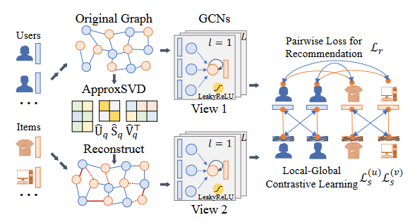
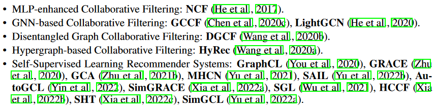
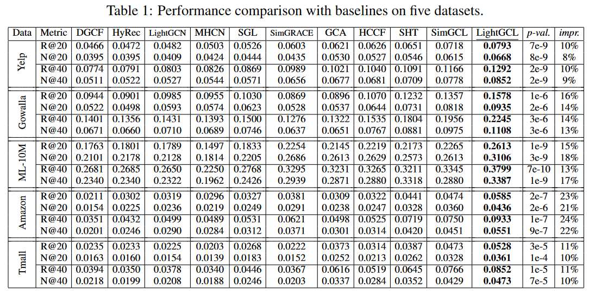
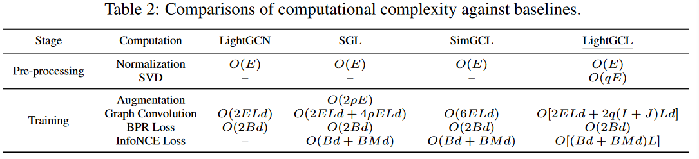
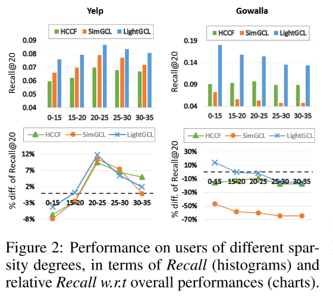
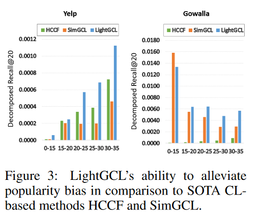
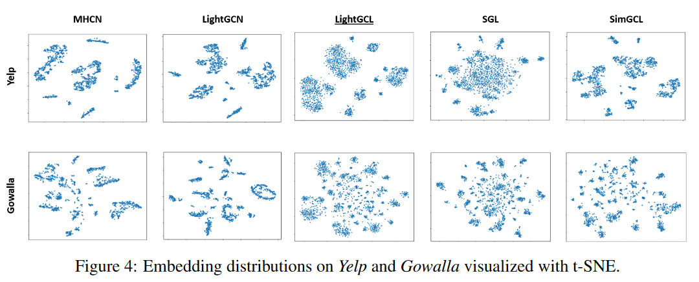
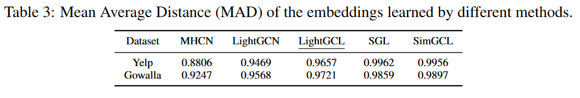
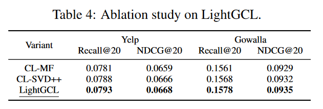
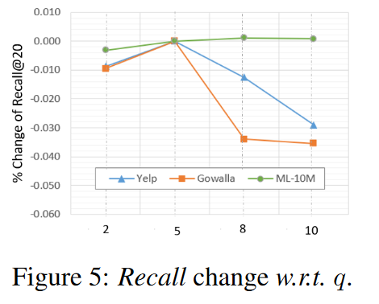

论文阅读：《LightGCL: Simple Yet Effective Graph Contrastive Learning for Recommendation》

> 论文信息
>
> 标题：LightGCL: Simple Yet Effective Graph Contrastive Learning for Recommendation
>
> 来源：ICLR 2023
>
> 地址：[2302.08191.pdf (arxiv.org)](https://arxiv.org/pdf/2302.08191.pdf)
>
> 代码：[HKUDS/LightGCL(github.com)](https://github.com/HKUDS/LightGCL)

# 1. 背景和贡献

**现有的挑战**

- 使用随机扰动进行图增强可能丢失有用的结构信息，这回误导表征学习
- 基于启发式的对比学习框架能够取得成功很大程度是建立在视图生成器(view generator)上，这限制了模型的通用性，并且容易受到用户行为噪声的影响
- 目前大部分基于GNN的对比推荐都会受到过平滑问题的限制，这会导致无法区分这些表征

**贡献**

- 本文设计了一个轻量级且鲁棒的图对比学习框架解决上述挑战
- 本文提出了一种高效的对比学习范式LightGCL用于图增强。通过注入全局协同关系，该模型可以缓解对比信号不准确带来的问题。
- 本文在多个真实数据集上实验展现了本模型的优越性，并进一步深入分析本模型的合理性和鲁棒性

# 2. 方法

LightGCL的总体框架图，如下所示：

**优点**

- 图片上半部分展示了GCN主体能够提取**局部图依赖关系**，下半部分展示了SVD引导的增强方法可以提取到**全局协同关系**
- 不仅提取了用户-物品交互的有用信息，而且还能将全局协同上下文信息注入到对比学习的表示对齐中
- 学习到的表示能够反映出用户特定的偏好和跨用户的全局依赖关系

## 3.1 局部图依赖关系建模

给每一个user $u_i$和item $v_j$分配嵌入向量$e_i^{(u)},e_j^{(v)} \in \mathbb{R}^d$，其中 $d$ 是嵌入维度大小。所有user和item组成的集合分别表示为 $\bold E^{(u)} \in \mathbb{R}^{I \times d}$ 和 $\bold E^{(v)} \in \mathbb{R}^{J \times d}$，其中 $I$ 和 $J$ 是user和item的数量。

本文使用两层GCN网络聚合每个节点的邻居信息。在第 $l$ 层，聚合过程可表示如下：
$$
z_{i,l}^{(u)}=\sigma(p(\tilde { A}_{i,:})·\bold E_{l-1}^{(v)}), \\ z_{j,l}^{(v)}=\sigma(p(\tilde { A}_{:,j})·\bold E_{l-1}^{(u)})
$$
其中 $z_{i,l}^{(u)}$ 和 $ z_{j,l}^{(v)}$ 分别表示user $u_i$ 和 item $v_j$ 的第 $l$ 层聚合嵌入表示，$\sigma(·)$ 使用LeakyReLU激活函数，$\tilde A$ 为归一化邻接矩阵，$p(·)$ 为edge Dropout方法。

最终的节点嵌入向量为各自节点在所有层的嵌入向量之和。user $u_i$ 对 item $v_j$ 的偏好预测可以使用二者的最终嵌入向量做内积得到：
$$
e_i^{(u)}=\sum_{l=0}^{L}e_{i,l}^{(u)},\\
e_j^{(v)}=\sum_{l=0}^{L}e_{j,l}^{(v)}, \\
\hat{y}_{i,j}=e_i^{(u) \bold{т}} · e _ j ^ { ( v )}
$$

## 3.2 全局协同关系学习

主要思想，就是对邻接矩阵 $A$ 使用SVD分解然后重构一个新邻接矩阵 $\hat A$ ，然后用于节点嵌入表征学习，生成新视图。公式表示如下：
$$
g_{i,l}^{(u)}=\sigma(\hat{\mathcal{A}}_{i,:}\cdot E_{l-1}^{(v)}),\\
g_{j,l}^{(v)}=\sigma(\hat{\mathcal{A}}_{i,j}\cdot E_{l-1}^{(u)})
$$
其中$\hat A$是$A$的低秩近似矩阵，且秩为$q$。但是直接使用SVD分解耗时又费力、不切实际，因此本文采用了由Halko提出的随机SVD算法，其关键思想是首先用低秩标准正交矩阵近似输入矩阵的范围，然后对这个较小的矩阵执行SVD。公式如下：
$$
\hat{U}_q,\hat{S}_q,\hat{V}_q^\top=\text{ApproxSVD}(\mathcal{A},q),\\
\hat{\mathcal{A}}_{SVD}=\hat{U}_q\hat{S}_q\hat{V}_q^\top
$$
其中，$q$为分解矩阵要求的秩大小，$\hat{U}_q\in\mathbb{R}^{I\times q},\hat{S}_q\in\mathbb{R}^{q\times q},\hat{V}_q\in\mathbb{R}^{J\times q}$ 是$U_{q},S_{q},{V}_{q}$的近似版本。因此，本文使用矩阵的形式重写上述第一个公式：
$$
G_l^{(u)}=\sigma(\hat{\mathcal{A}}_{SVD}E_{l-1}^{(v)})=\sigma(\hat{U}_q\hat{S}_q\hat{V}_q^\top E_{l-1}^{(v)});\\
G_l^{(v)}=\sigma(\hat{\mathcal{A}}_{SVD}^\top E_{l-1}^{(u)})=\sigma(\hat{V}_q\hat{S}_q\hat{U}_q^\top E_{l-1}^{(u)})
$$
为了节省空间和提升效率，本文仅存储低维近似矩阵$U_{q},S_{q},{V}_{q}$，并且在预处理阶段提前计算$(\hat{U}_q\hat{S}_q)$和$(\hat{V}_q\hat{S}_q)$ 。

## 3.3 简化的局部-全局对比学习

传统GCL如SGL和SimGCL是一种三视图（原视图、由原视图生成的两个新视图）参与的对比学习范式。在本文方法，本文的增强视图是由全局协同关系（使用SVD重构邻接矩阵）构建的。因此，本文直接将SVD增强视图和原视图使用InfoNCE做对比学习，以简化对比学习框架。公式如下：
$$
\cal L_s^{(u)}=\sum_{i=0}^{\it I} \sum_{l=0}^{\it L} -log\frac{\exp(s(\boldsymbol{z}_{i,l}^{(u)},\boldsymbol{g}_{i,l}^{(u)}/\tau))}  {\sum_{i'=0}^{\it I}\exp(s(\boldsymbol{z}_{i,l}^{(u)},\boldsymbol{g}_{i',l}^{(u)})/\tau)}
$$
其中，$s(·)$为余弦相似度，$\tau$为温度系数。损失$\cal L_s^{(v)}$与上式类似。为防止过拟合，在对比学习过程每一个batch使用node dropout。

总损失是由对比损失和推荐任务目标函数联合优化的：
$$
\mathcal{L}=\mathcal{L}_r+\lambda_1\cdot(\mathcal{L}_s^{(u)}+\mathcal{L}_s^{(v)})+\lambda_2\cdot\|\Theta\|_2^2;\\
\mathcal{L}_r=\sum_{i=0}^I\sum_{s=1}^S\max(0,1-\hat{y}_{i,p_s}+\hat{y}_{i,n_s})
$$
其中，$\hat{y}_{i,p_s}$ 和$\hat{y}_{i,n_s}$表示为用户$i$的一对正负item的预测分数。

# 4 评估

## 4.1 实验设置

**数据集**：Yelp、Gowalla、ML-10M、Amazon-book、Tmall

**评价指标**：Recall@N、NDCG@N      (N = {20, 40})

**Baseline**

## 4.2 性能分析

**RQ1**: How does LightGCL perform on different datasets compared to various SOTA baselines

- 使用对比学习方法更好：这可以归因于CL学习均匀分布嵌入的有效性
- 本文提出的对比方法最好：本文将这种性能改进归因于通过注入全局协同上下文信号来有效增强图对比学习。

## 4.3 效率分析

**RQ2**: How does the lightweight graph contrastive learning improve the model efficiency? 

- 虽然我们的模型需要在预处理阶段执行SVD，这需要O(qE)，但与训练阶段相比，计算成本可以忽略不计，因为它只需要执行一次。实际上，通过将对比视图的构建移到预处理阶段，我们避免了训练过程中重复的图增强，提高了模型效率。
- 传统的GCN方法(例如LightGCN)只在一个图上执行卷积，每batch的复杂度为$O(2ELd)$。对于大部分GCL方法，三个对比视图每个batch都要计算，这就导致复杂度大致是LightGCN的三倍。但是本文方法只涉及两个对比视图，并且$2q(I+J) < E$。（详细复杂度分析参考论文附录D）

## 4.4 鲁棒性分析

**RQ3**: How does our model perform against data sparsity, popularity bias and over-smoothing?

- 数据稀疏性：根据用户的交互程度（度数量）对稀疏用户进行分组，并在Yelp和Gowalla数据集上分别计算$Recall@20$。可以发现本文对于交互程度小的用户推荐性能也一样好，并且在Gowalla上交互少的用户，推荐性能最好。

- 流行度偏差（长尾分布）：按照交互的度大小将item进行分组。度越小，item越长尾。从下图可以看出，本文方法对度较小的商品，仍有不错的召回表现，说明有一定程度的缓解。
  - 在Gowalla上度较小的item相比于其他item有较高的召回率，是因为该数据集上交互较少的item占比很大很大。

## 4.5 过平滑和过均匀的平衡

**RQ3**: How does our model perform against data sparsity, popularity bias and over-smoothing?

- 本文从Yelp和Gowalla中随机抽取2000个节点，并使用t-SNE将它们的嵌入映射到二维空间，可视化如下图所示

  

- 并计算嵌入向量之间的平均距离(Mean Average Distance)

  

- 由上图可知，the embedding distributions of non-CL methods (i.e., LightGCN, MHCN) exhibit indistinguishable clusters in the embedding space, which indicates the limitation of addressing the over-smoothing issue.（作者说的，没理解）
- 在Yelp上使用的SGL生成的图中的点太过均匀，没有捕捉到用户之间的协同关系
- 在Gowalla上使用的SimGCL生成的图中，虽然有明显的离散小簇，但是簇里面有严重的过平滑问题，即簇里的嵌入向量太过相似。
- 而本文的方法可以识别出清晰的社区结构，以捕捉协同关系，而每个社区内部的嵌入是合理分散的，以反映用户特定的偏好，从而实现一种trade-off。

## 4.6 消融实验

**RQ4**: How does the local-global contrastive learning contribute to the performance of our model?

- 本文将近似SVD算法替换为两种MF和SVD++两种矩阵分解方法，发现使用矩阵分解的方法确实能引导对比学习，如下图所示。
- 但是，采用预训练的CL组件(MF, SVD++)不仅繁琐且耗时，而且在性能上也不如使用近似SVD算法

## 4.7 超参数调节实验

**RQ5**: How do different parameter settings affect our model performance?

没什么好叙述的，主要调节的参数为：InfoNCE损失的正则化权重$\lambda_1$，温度系数$\tau$，近似SVD给定的秩$q$。

提一点，关于秩的实验如下图所示。有一个问题：为什么秩增大，反而在两个数据集上的表现下降了呢？

# 5. 个人思考

本文最主要的贡献就是实现了一个只有二视图参与的对比学习框架——原视图和使用近似SVD重构引导的新视图进行对比学习，简化了传统对比学习框架的三视图流程。并且本文使用随机SVD算法近似生成增强邻接矩阵而不用进行SVD分解，以提升效率。

所以我一直思考，对比学习的本质到底是什么？为什么二视图参与的CL框架比三视图参与的CL框架取得更好的结果？这还需要我进一步探索。。。
