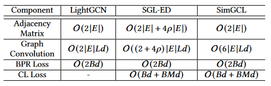

论文阅读：（SimGCL）《Are Graph Augmentations Necessary? Simple Graph Contrastive Learning for Recommendation》

> 论文信息
>
> 标题：Are Graph Augmentations Necessary? Simple Graph Contrastive Learning for Recommendation
>
> 来源：SIGIR 2022
>
> 地址：[http://arxiv.org/abs/2112.08679](https://arxiv.org/pdf/2302.08191.pdf)
>
> 代码：https://github.com/Coder-Yu/QRec

# 1. 背景和贡献

**挑战**

- 在对比学习过程中，使用图增强方法可以提升性能的原因还没有研究清楚

**动机**

- 近期工作发现即使在edge dropout为0.9的图增强情况下进行对比学习，也有较好的性能，这是相当反直觉的
- 提出疑问：“在使用基于CL的推荐过程中，我们真的需要图增强技术吗？”

**贡献**

- 通过实验揭示了为什么CL可以提高推荐性能，并说明了InfoNCE的loss是才决定性因素，而不是图增强技术。
- 抛弃了传统的图增强方法，向嵌入空间添加均匀噪声来创建对比视图

# 2. 推荐中的图对比学习研究

## 2.1 传统用于推荐的图对比学习

- 优化的联合损失为：
  $$
  \mathcal L_{joint}=\mathcal L_{rec}+\lambda \mathcal L_{cl}
  $$

  - $\mathcal L_{cl}$ 使用InfoNCE损失：
    $$
    \mathcal{L}_{cl}=\sum_{i\in\mathcal{B}}-\log\frac{\exp(\mathbf{z}_i^{\prime\top}\mathbf{z}_i^{\prime\prime}/\tau)}{\sum_{j\in\mathcal{B}}\exp(\mathbf{z}_i^{\prime\top}\mathbf{z}_j^{\prime\prime}/\tau)}
    $$

- 使用LightGCN作为骨干网络，节点嵌入可表示为：
  $$
  \mathbf{E}=\frac{1}{1+L}(\mathbf{E}^{(0)}+\tilde{\mathbf{A}}\mathbf{E}^{(0)}+...+\tilde{\mathbf{A}}^{L}\mathbf{E}^{(0)})
  $$

## 2.2 图增强的必要性

- 构造一个新的SGL变种——**SGL-WA**，其对比损失为：
  $$
  \mathcal{L}_{cl}=\sum_{i\in\mathcal{B}}-\log\frac{\exp(1/\tau)}{\sum_{j\in\mathcal{B}}\exp(\mathbf{z}_i^{\top}\mathbf{z}_j/\tau)}
  $$

- 不同SGL变体的性能比较（-ND表示node dropout，-ED表示edge dropout，-RW表示random walk，-WA表示没有使用图增强，CL only表示在SGL中只有CL损失被优化）。

  - 可以发现，SGL-WA在没有使用图增强方法时，也能达到出色表现。

  

## 2.3 InfoNCE损失影响更多

- 用非参数高斯核密度估计在 $\mathbb R^2$ 特征分布图

  - 在最左边的一栏中，LightGCN显示了高度聚集的特征，这些特征主要存在于一些狭窄的弧线上。而在第二列和第三列中，无论是否应用图增强方法，分布都变得更加均匀，密度估计曲线也不那么清晰。在第四列中，我们绘制了仅优化对比损失来学习的特征，分布几乎是完全均匀的。
  - 由此得知，特征分布的均匀性是对SGL中推荐性能有决定性影响的潜在因素，而不是基于dropout的图增强方法。

  

# 3. SimGCL框架

## 3.1 方法

- 对特征空间进行数据增强：直接向特征表征加入均匀噪声

**方法**

给定一个节点 $i$ 和其表征 $e_i$，使用如下的基于特征的增强方法：
$$
\mathbf{e}_{i}^{\prime}=\mathbf{e}_{i}+\Delta_{i}^{\prime},\mathbf{e}_{i}^{\prime\prime}=\mathbf{e}_{i}+\Delta_{i}^{\prime\prime}
$$
其中，添加的噪声 $\Delta_{i}^{\prime}$ 和 $\Delta_{i}^{\prime\prime}$ 会受到两个条件约束： 

- $\|\Delta\|_{2}=\epsilon $
  - 限制其模长，使其在数值上等价于半径为 $\epsilon$的超球上的点
- $\Delta=\bar{\Delta}\odot\mathrm{sign}(\mathbf{e}_{i}),\bar{\Delta}\in\mathbb{R}^{d} \sim U(0,1)$
  - 限制 $e_i, \Delta' 和\Delta''$ 在同一个超象限里，以至于加入噪声不会造成较大的偏离，使正样本的有效性降低。
  - $\odot$为element-wise乘积，sign(·)为指示函数
  - $sign(e_i)$ 表示 $e_i$ 的超象限

**做法**

最终的扰动节点表征：
$$
\begin{aligned}\mathrm{E'}=\frac{1}{L}((\tilde{\mathrm{AE}}^{(0)}+\Delta^{(1)})+(\tilde{\mathrm{A}}(\tilde{\mathrm{AE}}^{(0)}+\Delta^{(1)})+\Delta^{(2)}))+...\\+(\tilde{\mathrm{A}}^{L}\mathbf{E}^{(0)}+\tilde{\mathrm{A}}^{L-1}\Delta^{(1)}+...+\tilde{\mathrm{A}}\Delta^{(L-1)}+\Delta^{(L)}))\end{aligned}
$$

- 注意一点：在计算时，没有采用输入特征嵌入 $E^{(0)}$。因为实验时，去掉效果更好

## 3.2 调节均匀性

为了衡量特征的均匀性，使用Radial Basis Function (RBF) kernel算法评估：
$$
\mathcal{L}_{\mathrm{uniform}}(f)=log \underset{\stackrel{i.i.d}{u,v\sim P_{\mathrm{node}}}}{\mathbb{E}}e^{-2\|f(u)-f(v)\|_{2}^{2}}.
$$
结果如下图所示，可以发现注入噪声越强，原始特征越会被调节到更高的均匀程度。刚开始特征都很均匀是因为采用Xavier初始化，它是一个特殊的均匀分布。

## 3.3 时间复杂度

其中，$\abs{E}$ 为图的边数，$d$ 为嵌入大小，$B$为批大小，$M$为批中的节点数，$\rho$ 为SGL-ED中的edge dropout大小。

# 4. 实验评估

## 4.1 实验设置

**数据集**

- Douban-Book
- Yelp2018
- AmazonBook

**评价指标**

- Recall@20
- NDCG@20

**Baseline**

- Mult-VAE、DNN+SSL、BUIR、MixGCL

## 4.2 SGL vs. SimGCL

### 4.2.1 推荐性能

### 4.2.2 收敛速度

- SimGCL收敛最快，并且 $\epsilon$ 越大，收敛越快，但是不能过大（大于1）。
- SimGCL由于收敛快，容易过拟合

### 4.2.3 运行时间

### 4.2.4 去偏能力

- 80%点击/购买次数最少的商品被标记为“Unpopular”，5%点击/购买次数最多的商品被标记为“Popular”，其余商品被标记为"Normal"。
- 可以看出，SimGCL的性能改进都来自于不受欢迎的商品。它在推荐长尾商品方面的突出优势，很大程度上弥补了它在“热门”类上的损失。

## 4.3 超参数设置分析

$\lambda$ 依据不同数据集而设定

$\epsilon$ 设置在0.1附近，性能最好 

## 4.4 不同类型噪声的性能评估

- -a为adversarial noises generated by FGSM，-u为从$U(0,1)$分布采样的均匀噪声，-p为恒正的均匀噪声（不满足构造噪声时的第二约束），-g为标准正态分布采样的噪声