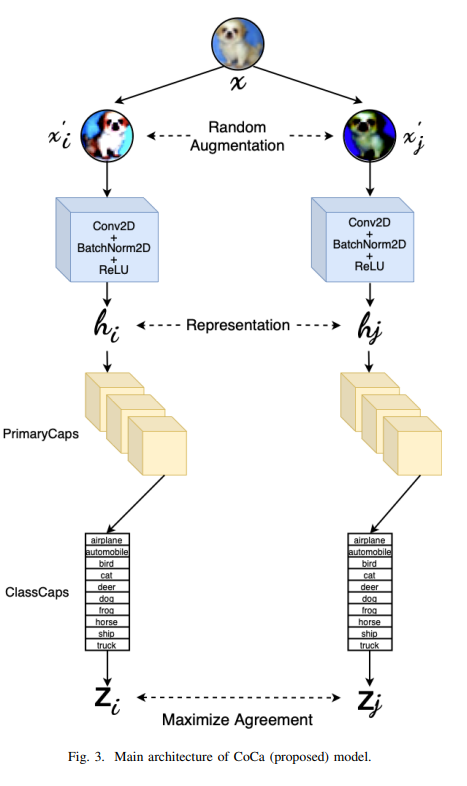

论文阅读：（CoCa）《Capsule Network based Contrastive Learning of Unsupervised Visual Representations》

> 论文信息
>
> 标题：Capsule Network based Contrastive Learning of Unsupervised Visual Representations
>
> 来源：Arxiv
>
> 地址：https://arxiv.org/pdf/2209.11276.pdf
>
> 代码：https://github.com/Harsh9524/CoCa

# 主要内容

思想：直接使用卷积层和胶囊层编码图片信息，并且最终分类任务只有10类，分类胶囊层个数也可以确定为10。对比学习使用的正例仍然是同一实例经过随机增强方法生成的增强视图。

解决任务：图片多分类任务

架构：

- 卷积块
  - 抽取底层特征
- 初始胶囊块
  - 用于第二次卷积并初始化胶囊输入
- 分类胶囊块
  - 编码空间信息并最终分类
- InfoNCE损失

