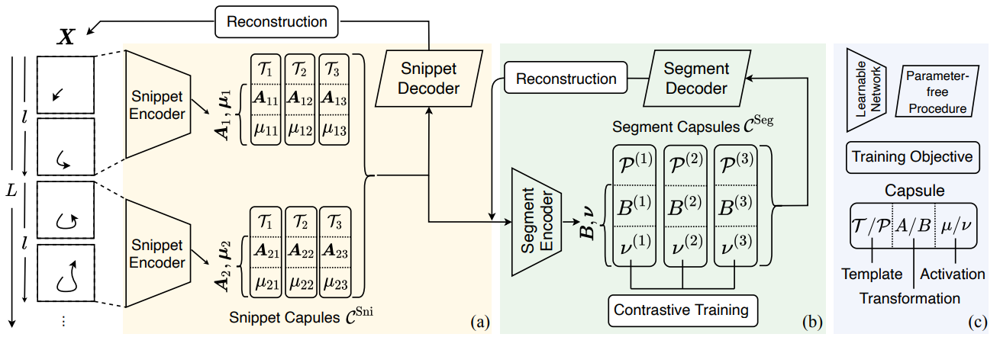

论文阅读：（MCAE）《Unsupervised Motion Representation Learning with Capsule Autoencoders》

> 论文信息
>
> 标题：Unsupervised Motion Representation Learning with Capsule Autoencoders
>
> 来源：NeurIPS '21
>
> 地址：https://proceedings.neurips.cc/paper_files/paper/2021/file/19ca14e7ea6328a42e0eb13d585e4c22-Paper.pdf
>
> 代码：https://github.com/ZiweiXU/CapsuleMotion
>
> tag：Capsule Autoencoder; Motion Representation;

## 0. 主要内容

解决任务：骨架动作识别任务

为了更好地建模动作模式/表征，提出了一种基于胶囊的无监督框架——MCAE，该框架使用两种动作胶囊从不同的层次生成表征，以学习到动作信号中动作变换的不变性信息。低层次的表征能够捕捉局部短时间内的动作，而高层次的表征中通过聚合低层次表征，能够对更大时间跨度的运动进行判别。

**术语定义**

- Snippet：一个短时间跨度的动作
- Segment：由多个时间顺序的Snippet组成，代表一个更长的时间动作

# 1. 方法

框架图如下：

- Snippet Auto-encoder
  - 通过重构输入信号 $\bold X$ 来学习与语义无关的短时间表示(Snippet capsules)
- Segment Auto-encoder
  - 通过聚合和重构Snippet capsule的参数来学习语义相关的长时间表示(Segment capsules)。将Segment capsules中的激活值作为语义信息用于自监督对比训练。

**符号定义**

- 点的轨迹：$\bold X =\{x_i|i=1,...,L\},where\ x_i \in \mathbb R^d$ 表示在时间 $i$ 的 $d$ 维空间的坐标表示
- snippets的长度为 $l$，snippet的个数为 $S=L/l$

# 2. 思考

整体读下来，对自己领域帮助不大，并且我也没搞懂文中的胶囊到底指的什么东西。但是这个流程感觉可以套用在序列推荐上，用户相邻两次购买不同类型的商品可以看作是相邻两个不同动作模式的切换。低层次建模行为较短的商品序列信息，高层次使用短行为序列信息重构出整体行为序列。胶囊网络可以建模每一种序列模式。