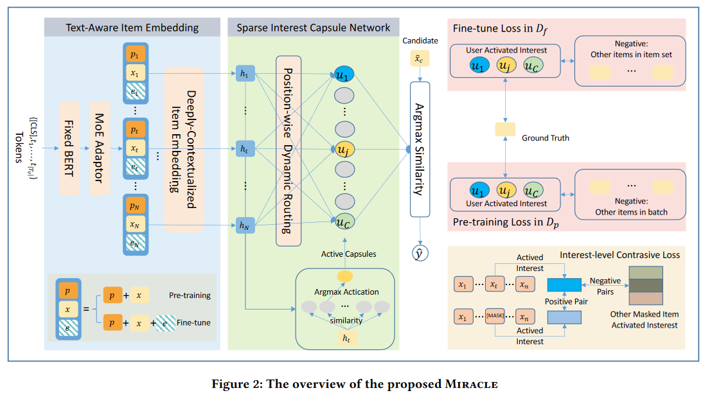

论文阅读：（MIRACLE）《Towards Multi-Interest Pre-training with Sparse Capsule Network》

> 论文信息
>
> 标题：Towards Multi-Interest Pre-training with Sparse Capsule Network
>
> 来源：SIGIR '23
>
> 地址：https://dl.acm.org/doi/pdf/10.1145/3539618.3591778
>
> 代码：https://github.com/WHUIR/Miracle
>
> tag：Sequential Recommendation; Multi-Interest Learning; Capsule Network; Contrastive Learning; Pre-training

# 1. 背景

**动机**：大部分传统方法（包括预训练）都是为每个用户学习到一个静态、固定的表征作为用户的偏好，这就无法捕捉用户多样的兴趣。因此当预训练一个推荐模型时，考虑用户的多兴趣特征是值得关注的。

**创新点**

- 不需要预定义用户的兴趣数量
- 显示建模时序信息

# 2. 方法

## 2.1 文本感知的商品嵌入

> 这部分参考如下文章：Hou Y, Mu S, Zhao W X, et al. Towards universal sequence representation learning for recommender systems[C]//Proceedings of the 28th ACM SIGKDD Conference on Knowledge Discovery and Data Mining. 2022: 585-593.
>
> domain bias: 当采用多个领域的数据集用作预训练时，由于不同领域之间的语义差距，学到的表征并没有映射到相同的语义空间

- Pre-trained Language Model-based Text Encoder

  - BERT~base~ with frozen parameters to encode the textual information of all items

- MoE Adaptor

  - mixture-of-expert (MoE) network to alleviate the domain bias
    $$
    x_i=\sum\limits_{k=1}^Gg_k\cdot Expert_k(t_i), \\
    g=sofmax(t_i\cdot W_1+b_1),\\
    Expert_k(t_i)=(t_i-b_2^k)\cdot W_2^k
    $$
    其中，$g_k$ 为第 $k$ 个专家网络的门控权值，$Expert_k(·)$ 为第 $k$ 个专家网络，$W_1\in\mathbb{R}^{d_b\times G},b_1\in\mathbb{R}^G,W_2^k\in\mathbb{R}^{d_b\times d_n},b_2^k\in\mathbb{R}^{d_n}$ ，$d_n$ 为专家网络隐藏层大小 ，$G$ 为专家数量

- Deeply-contextualized Item Embedding

  - L-layer Transformer to model the long-short term dependency between items

    - 额外添加可训练的位置嵌入 $P \in \mathbb R^{N\times d_n}$ ；MHA(·) 为多头自注意力

    $$
    F^{0}=[x_{1}+P_{1},x_{2}+P_{2},..,x_{N}+P_{N}], \\
    F^l=FFN(MHA(F^{l-1})), \\
    H = F^L = [h_1,...,h_N]
    $$

## 2.2 Sparse Interest Capsule Network

使用稀疏兴趣胶囊网络抽取用户的多个兴趣。在其动态路由阶段，采用稀疏兴趣胶囊激活机制灵活地确定兴趣数量并初始化耦合系数。

**Sparse Interest Capsule Activation**

- $A \in \mathbb R^{C \times d_n}$ ：基向量矩阵，指代通用兴趣空间，$C$ 为兴趣数量

被激活的胶囊子集反映了用户的多个兴趣。因此可以简单计算商品和基向量的相似度：
$$
s_{ij} = sim(h_i,a_j)·(1+\epsilon)
$$
其中，$sim(·)$ 为内积，$h_i$ 为第 $i$ 个商品的嵌入，$a_j$ 为第 $j$ 个基向量，$\epsilon$ 为高斯噪声。

为每个商品激活一个兴趣胶囊，并生成相应的胶囊激活向量 $m_i$ :
$$
m_{ij}=\begin{cases}-\infty,&\text{if j not in any}\arg\max(s_i);\\0,&\text{otherwise}\end{cases},
$$
其中，$m_{ij}=0$ 意味着第 $j$ 个兴趣胶囊被激活，且 $s_i=[s_{i2},...,s_{iC}]$ 。

**Position-wise Capsule Network**

考虑位置信息，使用注意力机制计算在不同位置上商品的重要性
$$
o=softmax(tanh((H+\tilde{P})W_3+b_3)W_4+b_4),
$$

# .思考

推荐+胶囊网络 = 基于用户多兴趣的推荐

- 用户兴趣个数 = 胶囊网络最后一层的个数