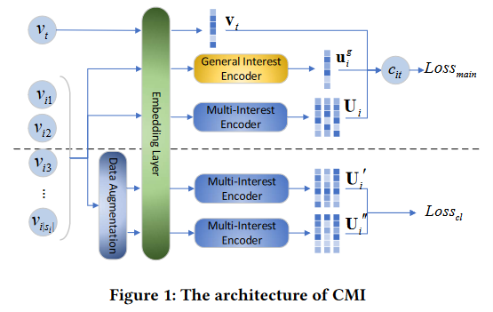
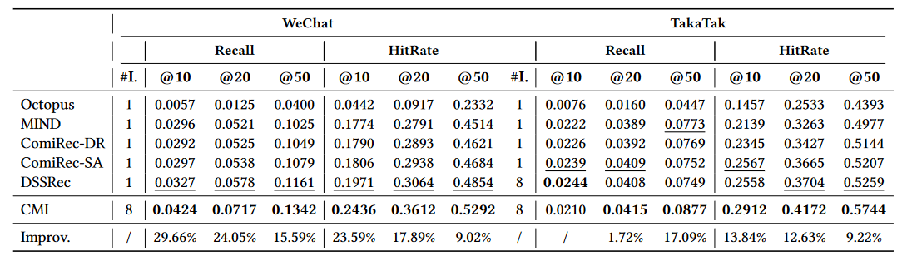

论文阅读：（CMI）《Improving Micro-video Recommendation via Contrastive Multiple Interests》

> 论文信息
>
> 标题：Improving Micro-video Recommendation via Contrastive Multiple Interests
>
> 来源：SIGIR '22
>
> 地址：https://dl.acm.org/doi/pdf/10.1145/3477495.3531861
>
> 代码：https://github.com/libeibei95/CMI/tree/main
>
> tag: Micro-video Recommendation; Multi-Interest Learning; Contrastive Learning; 

# 1. 背景

**动机**

当观看短视频时会存在“噪音”。这是因为短视频是自动播放的，这种自动播放的特性可能导致用户无法立即做出喜欢或不喜欢的判断，从而在交互中引入了不确定性或模糊性，这种情况被描述为“噪音”。并且，现有的短视频推荐模型和多兴趣推荐模型都没有利用对比学习来减少正向交互中噪声的影响。

主要工作：利用注意力机制获取用户的多个兴趣，然后通过对比学习实现过程去噪，增强推荐模型的鲁棒性。

**创新点**

- 探索将对比学习应用在多兴趣推荐任务上的可行性，实现交互过程去噪

# 2. 方法

## 2.1 多兴趣编码器和通用兴趣编码器

> 作者认为用户的兴趣是基于商品的类别，用户对商品某种类别的偏好构成了该用户的兴趣

有 m 个商品类别，对应的嵌入向量为 $[g_1,g_2,...,g_m]$。对于用户 u~i~ 的历史交互序列 s~i~ 的商品，通过嵌入层获得每个商品的嵌入，构成 $S_i=[v_{i1}, v_{i2}, ...,v_{ik},... v_{i \abs{s_i}}]$ 。然后使用商品嵌入和类别嵌入的余弦相似度分数衡量商品是否属于该类别。具体来说，商品 v~ik~ 和 类别 l 的相似度计算如下：
$$
w_{ik}^{l}=\frac{\mathbf{g}_{l}^{T}\mathbf{v}_{ik}}{\|\mathbf{g}_{l}\|_{2}\|\mathbf{v}_{ik}\|_{2}}
$$
因此，商品属于类别 l 的概率为:
$$
p_{ik}^l=\frac{\exp\left(w_{ik}^l/\epsilon\right)}{\sum_{l=1}^m\exp\left(w_{ik}^l/\epsilon\right)}
$$
然后，属于类别 l 的用户兴趣 $u_i^l$ 计算如下：
$$
\mathbf{u}_{i}^{l}=\Sigma_{k=1}^{|s_{i}|}p_{ik}^{l}\mathbf{v}_{ik}
$$
 此外，使用GRU网络建模用户的通用兴趣，用户通用兴趣为 $\mathbf{u}_{i}^{\boldsymbol{g}}=GRU\left(\left[\mathbf{v}_{i1},\mathbf{v}_{i2},\ldots,\mathbf{v}_{i|s_{i}|}\right]\right).$

## 2.2 对比正则化

> 作者认为部分交互序列中隐含的用户兴趣是与所有交互序列中隐含的用户兴趣相同。

对原序列进行随机采样两次，得到子序列 $s_i'$ 和 $s_i''$ 。然后将这两个增强序列送入多兴趣编码器学习两组用户兴趣，即 $\mathbf{U}_{i}^{\prime}=\big[\mathbf{u}_{i}^{1\prime},\mathbf{u}_{i}^{2\prime},\ldots,\mathbf{u}_{i}^{\boldsymbol{m}\prime}\big], \mathbf{U}_{i}^{\prime\prime}=\big[\mathbf{u}_{i}^{1\prime\prime},\mathbf{u}_{i}^{\boldsymbol{2}\prime\prime},\ldots,\mathbf{u}_{i}^{\boldsymbol{m}\prime\prime}\big]$ 。

对于这两组用户兴趣嵌入，将同一个用户的同一种兴趣嵌入作为正例，将其余情况都作为负例，因此负例个数有 $2m(|\mathcal{B}|-1)+2(m-1)=2(m|\mathcal{B}|-1)$ ，记为 $\mathcal S^-$ 。
$$
\mathcal{L}_{cl}\left(\mathbf{u}_i^{k\prime},\mathbf{u}_i^{k\prime\prime}\right)=-\log\frac{e^{\sin(\mathbf{u}_i^{k\prime},\mathbf{u}_i^{k\prime\prime})}}{e^{\sin(\mathbf{u}_i^{k\prime},\mathbf{u}_i^{k\prime\prime})}+\sum_{s^-\in\mathcal{S}^-}e^{\sin(\mathbf{u}_i^{k\prime},s^-)}} 
\\ -\log\frac{e^{\sin(\mathbf{u}_i^{k\prime},\mathbf{u}_i^{k\prime\prime})}}{e^{\sin(\mathbf{u}_i^{k\prime},\mathbf{u}_i^{k\prime\prime})}+\sum_{s^-\in\mathcal{S}^-}e^{\sin(\mathbf{u}_i^{k\prime\prime},s^-)}}
$$
通过数据增强和对比多兴趣损失，用户兴趣学习对特定的交互序列不再敏感，从而减少了有噪声的交互的影响，实现了交互去噪。

## 2.3 模型优化

为了防止不同的兴趣都学到相同的表达，以及避免所有商品都属于同一类，需限制类别嵌入和商品嵌入在一个单位超球面上，即 $||g_i||_2=||v_*||_2=1$ ；限制两两类别嵌入相互正交，即：
$$
\mathcal{L}_{orth}=\sum_{i=1}^{m}\sum_{j=1,j\neq i}^{m}(\mathbf{g}_{i}^{T}\mathbf{g}_{j})^{2}
$$
用户 $u_i$ 对商品 $v_t$ 的预测分数为：
$$
c_{it}=\max_{1 \leq k\leq m}\left(\left\{\mathbf{u}_{i}^{kT}\mathbf{v}_{t}/\epsilon\right\}\right)+\mathbf{u}_{i}^{gT}
$$
推荐损失使用交叉熵损失：
$$
\mathcal{L}_{main}\left(u_{i},v_{p}^{i}\right)=-\ln\frac{\exp\left(c_{i\boldsymbol{p}}\right)}{\sum_{v_{*}\in\left\{\mathcal{N}\cup v_{\boldsymbol{p}}^{\boldsymbol{i}}\right\}}\exp\left(c_{\boldsymbol{i}*}\right)}
$$
其中，$v_p^i$ 为用户 $u_i$ 交互过的正例，负例集合 $\mathcal N$ 为一个batch中其他用户的负采样商品和正采样商品集合，且负采样的个数为1。

联合优化函数：
$$
{\mathcal L}={\mathcal L}_{\mathrm{main}}+\lambda_{cl}{\mathcal L}_{cl}+\lambda_{\mathrm{or}th}{\mathcal L}_{\mathrm{or}th}
$$

# 3. 结果

# 4. 思考

与MIRACLE的思想类似（但是CMI论文先发的），不同的地方有：

- CMI使用注意力机制获取用户兴趣，MIRACLE使用胶囊网络
- CMI在计算用户对商品的分数时，不仅考虑每个兴趣对商品的影响，还综合考虑所有兴趣对其影响，而MIRACLE指考虑前者
- CMI认为一个商品对所有兴趣都有贡献度，而MIRACLE认为一个商品只能属于一个兴趣