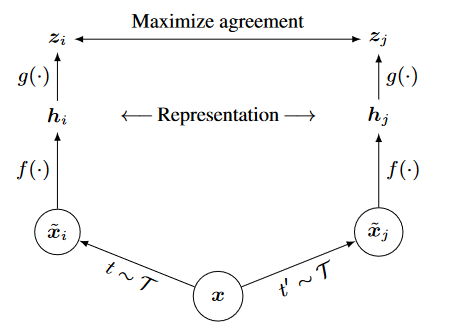
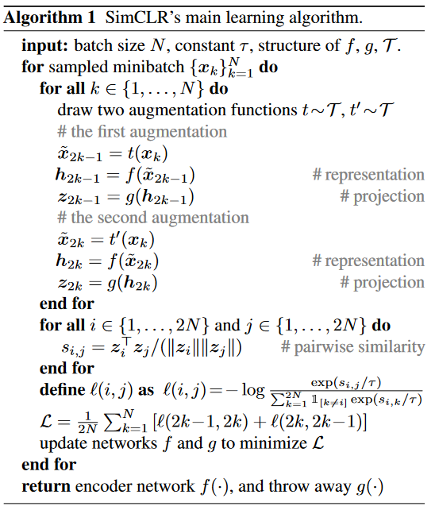
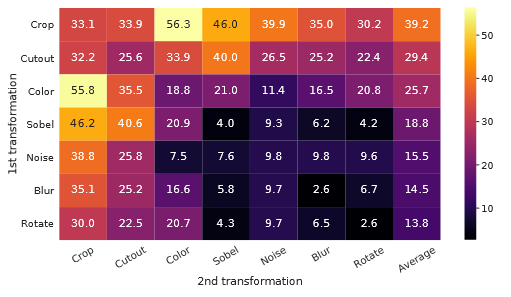
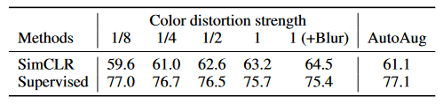
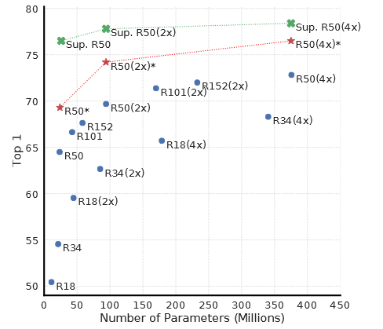
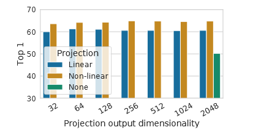
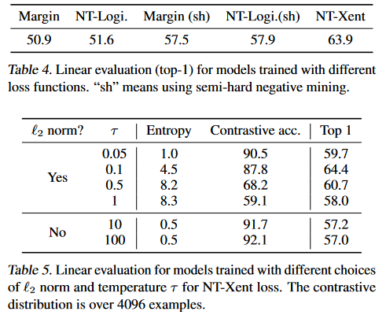
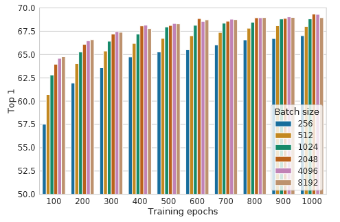

论文阅读：SimCLR

> 论文信息
>
> 标题：A Simple Framework for Contrastive Learning of Visual Representations
>
> 来源：ICML 2020
>
> 地址：[download](https://arxiv.org/pdf/2002.05709.pdf)
>
> 代码：[download](https://github.com/google-research/simclr)

# 1. 动机和贡献

对于如何无监督地学习出有效视觉表征问题，目前主要有两类方法：生成式和判别式。生成式方法计算成本高，并且基于对比学习的判别式方法最近表现得好，大有前景。因此提出了一个面向视觉表征的简单对比学习框架，$SimCLR$。

主要贡献：

1. 多种数据增强操作组合，很重要
2. 在生成表征和计算对比损失之间加一个可学习的非线性转换层，很重要
3. 归一化嵌入向量和选择合适的温度系数，很重要
4. 更大的batch size和更长的训练时间，很重要

# 2. 方法

## 2.1 对比学习框架

最终目的：SimCLR==通过潜在空间中的对比损失来最大化相同数据样本的不同增强视图之间的一致性==，来学习特征表征。框架如下图所示：

**主要构成**：

- **数据增强**模块
  - 使用数据增强方法，生成同一样本的两个相关视图，即$\tilde x_i$和$\tilde x_j$（互为正样本对）
  - 本文使用随机裁剪、随机颜色失真、随机添加高斯模糊
- 神经网络**编码器**(base encoder) $f(·)$
  - 学习增强样本数据的编码向量
  - 本文使用ResNet网络
- 小的神经网络**投影头**(projection head) $g(·)$
  - 将表征映射到对比损失所在的空间
  - 本文使用两层MLP网络
- 对比损失函数
  - 用于训练对比预测任务

**对比损失**

我们随机采样一个N笔的minibatch，并在由minibatch衍生的2N个增强样本中定义对比学习任务。由同一样本生成的增强样本互为正样本对，而剩余2(N-1)个增强样本都认为是负例。因此，对于一个正样本对$(z_i,z_j)$，对比损失函数公式表示为：
$$
l_{i,j} = - log \frac{exp(sim(z_i,z_j)/\tau)}{{\textstyle \sum_{k=1}^{2N} {\mathbb{I_{k\neq i}} exp(sim(z_i,z_k)/\tau)} } }
$$
其中 $\mathbb{I} \in {0,1}$ 是一个指示函数，$\tau$为温度系数，$sim(·)$使用余弦相似度。

**算法流程**

需要注意的是，最终的总损失是在minibatch中计算所有正样本对$(z_i,z_j)$和$(z_j,z_i)$。

# 3. 对比学习中的数据增强研究

## 3.1 数据增强操作的组合

如下图所示，可以发现数据增强操作的组合对于学习良好的表示是至关重要的。

## 3.2 对比学习需要更强的数据增强

如下图所示，可以发现相比于监督学习，对比学习使用更强的(颜色)数据增强方法，准确率得到更大地改善。

# 4. Encode和Head架构研究

## 4.1 对比学习受益于更大的模型

## 4.2 非线性投影头很有用

# 5. 损失函数和批大小

## 5.1 带有可调节温度系数的正则化交叉熵损失最好

## 5.2 越大的批大小以及越长的训练时间，学习越好

# 6. 结论

我们提出了一个简单框架用于视觉表征对比学习。并对框架的各个组成部分做了详细的研究，展示了不同方法选择的影响。